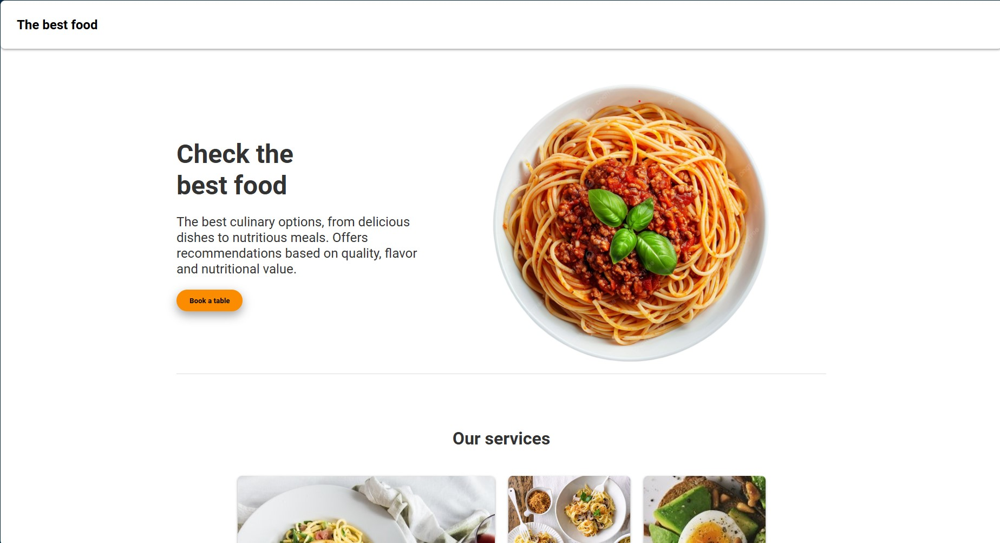

# css-grid-TheBestFood.github.io
---
https://braynel87.github.io/css-grid-TheBestFood.github.io/
---

# 🍝 The Best Food - Landing Page

Proyecto de página web de restaurante usando HTML5 y CSS Grid. Incluye diseño responsivo, estructura semántica y una galería de platos y servicios organizada en cuadrícula. Ideal para mostrar menús y destacar la oferta gastronómica de forma moderna y atractiva.

---

## 🚀 Vista previa

---

## 📌 Características

- Diseño responsivo usando **CSS Grid** y **Flexbox**.
- Sección de presentación con imagen destacada.
- Botón de acción "Book a table".
- Sección de servicios con tarjetas.
- Código limpio y organizado.

---

## 🛠️ Tecnologías utilizadas

- **HTML5**  
- **CSS3 (Grid, Flexbox, Transiciones)**  
- **JavaScript**  

---

## 📂 Estructura del proyecto

---

## ▶️ Cómo usarlo

https://braynel87.github.io/css-grid-TheBestFood.github.io/

---

👨‍💻 Autor

Proyecto creado por BrayneL87 ✨
